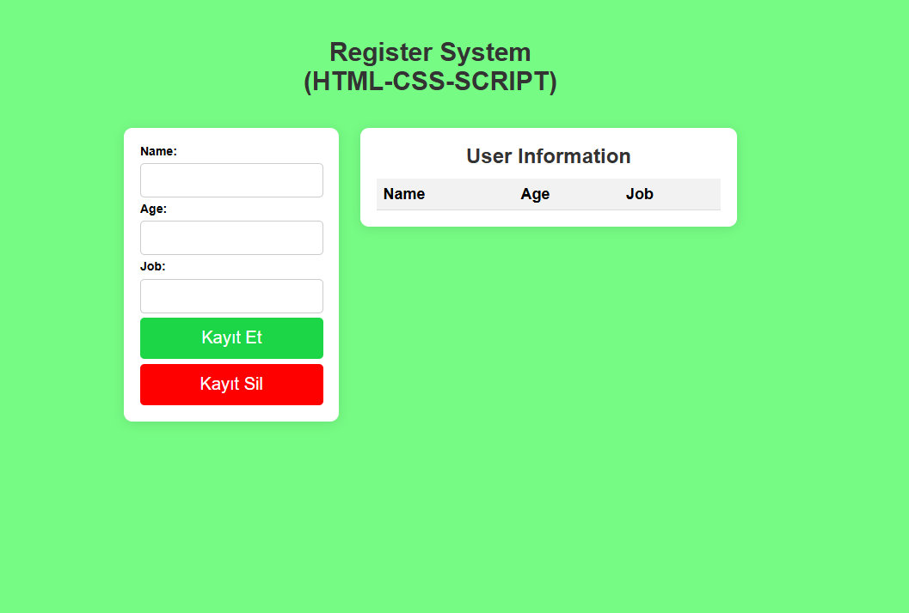

# Register System

This project is a simple registration system built with HTML, CSS, and JavaScript.

## Features

- User registration form
- Basic input validation
- Responsive design

## Getting Started

1. Clone the repository or download the files.
2. Open `index.html` in your browser.

## File Structure

- `index.html` - Main HTML file
- `style.css` - Stylesheet
- `script.js` - JavaScript logic

## Live

You can try the live demo here: [https://register-system-html-css-script.vercel.app/](https://register-system-html-css-script.vercel.app/)

## Screenshot

## License

This project is licensed under the MIT License.